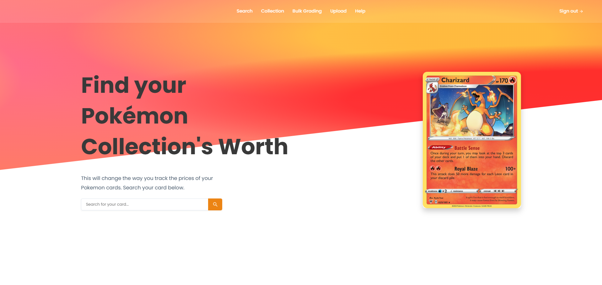

# TCG_Tracker

## Tutorial

- Our TCG Tracker will allow users to determine whether a card is worth getting graded based on:
  - Cost
  - Grading cost
  - Price of a graded card
- Features we want to implement
  - A user can either look up the card by its name or scan it with our app
  - Users will also be able to add their trading cards to their own personalized database which keeps track of its cost and value.

## How to run

### To run the client

- Run `cd client`
- Run `npm install`
- Run `npm run dev`

### To run the server

- Run `cd server`
- Run `npm install`
- Run `npm run dev`
